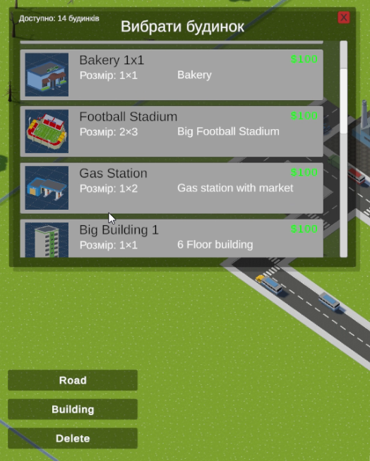
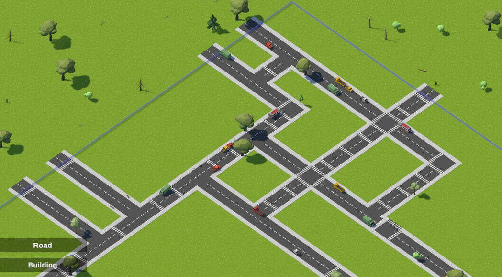

# 🏙️ Modular City Builder

> *Модульний симулятор міста на Unity Engine з використанням програмних патернів та принципів модульної архітектури.*

---

## 👤 Автор

- **ПІБ**: Серафим Дмитро  
- **Група**: ФЕП-41
- **Керівник**: Мисюк Р.В., науковий ступінь, посада
- **Дата виконання**: [31.05.2025]

---

## 📌 Загальна інформація

- **Тип проєкту**: Ігровий додаток (City Builder)
- **Мова програмування**: C#
- **Рушій**: Unity 6000.1.4f1 (Universal Render Pipeline)
- **Фреймворки / Бібліотеки**: Input System, Assembly Definitions, NUnit Testing

---

## 🧠 Опис функціоналу

- 🏗️ **Система будівництва:** Модульне розміщення будівель з UI меню та картками
- 🛣️ **Дорожня система:** Автоматичне з'єднання доріг з різними типами перехресть
- 🚗 **Система трафіку:** Автомобілі з реалістичним рухом 
- 🎨 **Декоративна система:** Автоматичне розміщення лавок, знаків, дерев та рослин
- 🎮 **Управління:** Інтуїтивна камера з Input System та зручний UI
- 🏙️ **Межі міста:** Візуальні границі з прозорими стінами та стовпчиками
- 🌱 **Природне оточення:** Генерація трави та рослин навколо міста
- 🧩 **Модульна архітектура:** Незалежні компоненти з Assembly Definitions
- 🔄 **EventBus система:** Слабке зв'язування між модулями
- 🏭 **Програмні патерни:** Factory, Observer, Command, Strategy Pattern
- 🧪 **Тестування:** Система автоматизованого тестування (13 тестів)

---

## 🧱 Опис основних класів / файлів

| Клас / Файл | Призначення |
|------------|-------------|
| `GridManager.cs` | Основний менеджер сітки, режимів будівництва та координат |
| `TrafficSystem.cs` | Система трафіку з автомобілями та правилами руху |
| `BuildingUIManager.cs` | Управління UI для будівництва та режимів |
| `BuildingMenuManager.cs` | Менеджер меню вибору будівель |
| `BuildingCard.cs` | UI картка для відображення інформації про будівлю |
| `CameraController.cs` | Контролер камери з Input System |
| `StreetDecorator.cs` | Автоматичне декорування вулиць (лавки, знаки, дерева) |
| `TerrainDecorator.cs` | Генерація природного оточення (трава, рослини) |
| `CityBoundary.cs` | Система візуальних границь міста |
| `WorldGenerator.cs` | Генератор початкового світу |
| `BuildingConfig.cs` | ScriptableObject конфігурація будівель |

---

## ▶️ Як запустити проєкт з нуля

### 1. Встановлення інструментів

- **Unity Hub** + **Unity 6000.1.4f1** або новіша
- **Git** для клонування репозиторію
- **Visual Studio Community** або **VS Code** для редагування коду

### 2. Клонування репозиторію

```bash
git clone https://github.com/DarDyng/City-Builder
cd City-Builder
```

### 3. Встановлення Unity модулів

При встановленні Unity 6000.1.4f1 оберіть модулі:
- ✅ Microsoft Visual Studio Community
- ✅ Windows Build Support (якщо на Windows)
- ✅ Mac Build Support (якщо на Mac)

### 4. Відкриття проекту

```bash
# Відкрийте Unity Hub
# Натисніть "Open" або "Add"
# Виберіть папку City-Builder
# Дочекайтеся імпорту ресурсів
```

### 5. Налаштування пакетів

Unity автоматично встановить необхідні пакети:
- **Input System** - для управління
- **Universal RP** - для рендерингу  
- **Test Framework** - для тестування

### 6. Запуск

```bash
# У Unity Editor:
# 1. Відкрийте Assets/_Project/Scenes/MainScene.unity
# 2. Натисніть кнопку ▶️ Play
```

---

## 🔌 Система модулів

### 🏗️ Building System

**Основні компоненти:**

```csharp
// Розміщення будівлі через GridManager
gridManager.PlaceBuilding(x, z, buildingConfig);

// Події через EventBus
gridManager.OnTileChanged += OnTileChanged;
gridManager.OnModeChanged += UpdateModeDisplay;
```

**BuildingConfig ScriptableObject:**

```csharp
[CreateAssetMenu(fileName = "BuildingConfig", menuName = "City Builder/Building Config")]
public class BuildingConfig : ScriptableObject
{
    public string buildingName;
    public Vector2Int size;
    public GameObject prefab;
    public Sprite icon;
    public int cost;
}
```

---

### 🚗 Traffic System

**Система трафіку:**

```csharp
// Налаштування автомобілів
[SerializeField] private GameObject[] carPrefabs;
[SerializeField] private int maxCarsTotal = 20;
[SerializeField] private float carSpeed = 5f;
[SerializeField] private bool rightHandTraffic = true;

// Динамічне сканування доріг
ScanRoads();
BuildRoadConnections();
```

---

### 🎨 Decoration System

**Автоматичне декорування:**

```csharp
// StreetDecorator - лавки, знаки, дерева біля доріг
[SerializeField] private GameObject[] benchPrefabs;
[SerializeField] private GameObject[] signPrefabs;
[SerializeField][Range(0f, 1f)] private float decorDensity = 0.3f;

// TerrainDecorator - природне оточення
[SerializeField] private GameObject grassTilePrefab;
[SerializeField] private GameObject[] plantPrefabs;
```

---

### 🎮 Input & Camera System

**Сучасний Input System:**

```csharp
// Управління камерою з мишею
private Mouse mouse = Mouse.current;

// Обробка drag & zoom
HandleMouseDrag();
HandleZoom();

// Raycast для взаємодії з сіткою
Vector2Int gridPosition = GetGridPositionFromMouse();
```

---

## 🖱️ Інструкція для користувача

### 1. **Управління камерою**
   - **Переміщення**: Утримуйте середню кнопку миші і рухайте мишею
   - **Масштабування**: Колесо миші вгору/вниз
   - **Межі**: Камера автоматично обмежена областю сітки
   - **Скасування**: ПКМ або Escape для виходу з режиму

### 2. **Система будівництва**
   - Натисніть кнопку `🏗️ Buildings` у верхньому меню
   - Відкриється **меню з картками будівель**:
     - 🏠 **House** - житловий будинок (1×1)
     - 🏢 **Office** - офісна будівля (2×2)  
     - 🏭 **Factory** - промислова споруда (3×3)
   - Виберіть будівлю з меню та клікніть на вільну область
   - Під будівлями автоматично створюється бетонна основа

### 3. **Дорожня система**
   - Натисніть кнопку `🛣️ Roads`
   - Клікайте по клітинках для створення доріг
   - **Автоматичні з'єднання**: дороги самостійно адаптуються
     - Прямі дороги
     - Повороти
     - T-подібні перехрестя
     - Повні перехрестя

### 4. **Транспортна система**
   - **Автомобілі з'являються автоматично** на дорогах
   - **Правила руху**: правосторонній рух з дотриманням смуг
   - **Налаштування**: швидкість, кількість машин, інтервал спавну
   - **Адаптивність**: машини зникають при видаленні доріг

### 5. **Декоративна система**
   - **Автоматичне декорування вулиць**:
     - 🪑 Лавки біля будинків
     - 🚧 Дорожні знаки на перехрестях  
     - 🌳 Дерева вздовж доріг
     - 🚥 Дорожні конуси
   - **Природне оточення**:
     - 🌱 Трава навколо міста
     - 🌿 Випадкові рослини

### 6. **Видалення об'єктів**
   - Натисніть кнопку `🗑️ Delete`
   - Клікніть на будь-який об'єкт для видалення
   - **Розумне видалення**: будівлі видаляються повністю з основою

### 7. **Візуальні ефекти**
   - **Прозорі границі міста** з синіми стінами
   - **Preview система**: напівпрозорий попередній перегляд
   - **Кольорові індикатори режимів** у UI

---

## 📷 Приклади / скриншоти

- **Головне меню**: UI з кнопками режимів (Roads, Buildings, Delete)
- **Меню будівель**: Картки з іконками, описами та цінами будівель
- **Процес будівництва**: Напівпрозорий preview та розміщення на сітці
- **Дорожня мережа**: Автоматичні з'єднання та різні типи перехресть
- **Система трафіку**: Автомобілі з реалістичним рухом по смугах
- **Декоративні елементи**: Лавки, знаки, дерева вздовж вулиць
- **Природне оточення**: Трава та рослини навколо міста
- **Границі міста**: Прозорі стіни з візуальним обмеженням
- **Завершене місто**: Повнофункціональне поселення з трафіком

*(скріншоти у папці `/Screenshots/`)*

---

## 🧪 Проблеми і рішення

| Проблема | Рішення |
|----------|---------|
| "Assembly compilation errors" | Встановити Input System package, змінити Project Settings → Player → Active Input Handling на "Input System Package (New)" |
| "Missing scripts" з TrafficSystem | Переконатися що всі файли завантажилися, Assets → Reimport All |
| "Render Pipeline errors" | Встановити Universal RP package, призначити URP Asset у Project Settings → Graphics |
| Машини не з'являються на дорогах | Перевірити що carPrefabs призначені у TrafficSystem, перевірити GridManager посилання |
| Декорації не генеруються | Призначити префаби у StreetDecorator та TerrainDecorator компонентах |
| BuildingConfig не завантажується | Перевірити що BuildingConfig файли створені через Create → City Builder → Building Config |
| Камера не реагує на Input System | Перевірити що Input System package встановлений та налаштований правильно |
| Проект не відкривається | Використовувати Unity 6.x, видалити папки Library/ та Temp/, перевірити .meta файли |
| Границі міста не відображаються | Призначити boundaryMaterial у CityBoundary або перевірити Shader налаштування |

---

## 🧾 Використані джерела / література

- Unity Documentation - Input System
- Unity Documentation - Universal Render Pipeline  
- Unity Documentation - Assembly Definitions
- Design Patterns: Elements of Reusable Object-Oriented Software
- Clean Architecture by Robert C. Martin
- Unity Test Framework Documentation
- C# Programming Guide - Microsoft Docs

---

## 🔗 Посилання

**GitHub репозиторій:** https://github.com/DarDyng/City-Builder

**Технічні характеристики:**
- Unity версія: 6000.1.4f1
- .NET версія: .NET Standard 2.1
- Render Pipeline: Universal RP
- Input System: New Input System
- Архітектура: Event-driven з Observer Pattern
- Декораційні системи: Процедурна генерація
- Трафік: Реалістична AI поведінка з правилами руху

---

## Screenshots




